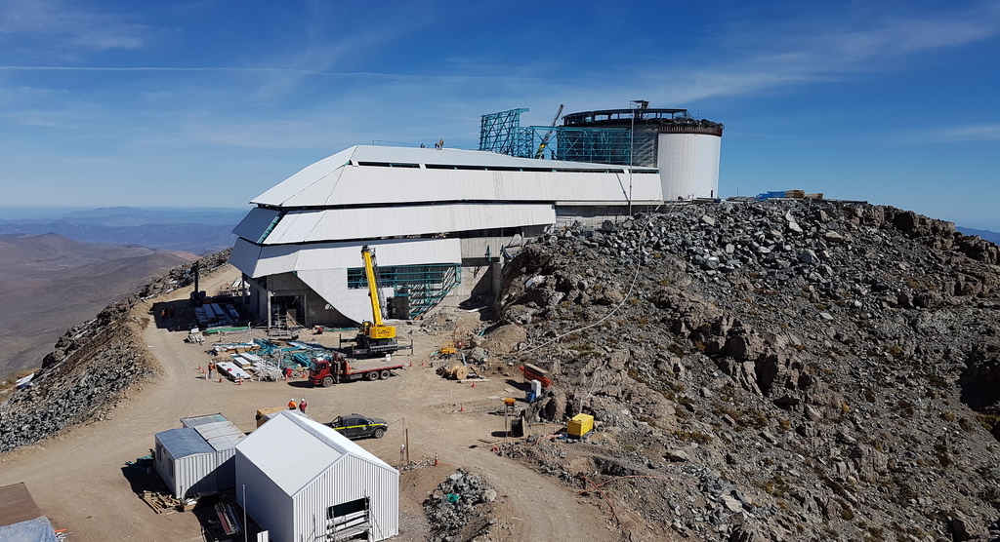

# Images

Images for inclusion in latex documents (or anyplace else). The idea is there is one master copy of any image/org chart etc .. which is used in all docs rather than copies ending up in many different repos .. well we can try right ?. 

You should have this in the root of dm-docs - other docs will sym link to it as images.

<embed>
<table>
<tr><th>Image <th>File name<th>Description
<tr><td>  <td> 2kDesign.jpg<td> Year 2000 optical design diagram 
<tr> <td><td>AnnualReprocessingDataFlow.pdf <td>
<tr><td> <td>AstronomerCartoon.png <td> Cartoon about astronomers not using telescopes (Zeljko)
<tr><td> <td>BarringerCrater.png  <td> Picture of Barringer crater used in meteor slides .. it shows to scale Statue of Liberty and LSST in the crater (Zeljko)
<tr><td> <td>Blast_20-full.jpg<td> Photo showing blast on top  Cerro Pachon during the leveling of the peak
<tr><td> <td>CMB.png<td> Lambda CDM graphic showing the big bang through to WMAP
<tr><td> <td>CatVolTime.png<td> Volume of catalog data over time from LDM-144
<tr><td> <td>DAQbb.jpg<td> Data Acquisition System Back Board at NCSA (2017)
<tr><td> <td>DAQfb.jpg<td> Data Acquisition System Front  Board at NCSA (2017)
<tr><td> <td>DMMasterSchedule.pdf<td> DM master milestone schedule for slides. Refer to LDM-503.
<tr><td> <td>DMSCommonServices.pdf<td>   DM Common services from Architecture (LDM-148)
<tr><td> <td>DMSDeployment.pdf<td> DN Deployment from Arch (LDM-148)
<tr><td> <td>DMS_Architecture.png<td> High level view of DM architecture from LDM-148
<tr><td> <td>DM_Application_Software_Arch.png<td> DM software stack on diagram (KT)
<tr><td> <td>DarkMatterPie.png<td>  Pie Chart of Dark Matter and Physical Matter - What do we know ?
<tr><td> <td>DataBackbone.pdf<td> Components of Data BackBone from LDM-148
<tr><td> <td>DmMap.png<td> Geographical map showing DM team locations, original is on <a url=https://project.lsst.org/content/project-org-chart> Project Website</a>.
<tr><td> <td>DmOrg.pdf<td> DM Org chart from LDM-294
<tr><td> <td>DocTree.pdf<td>DM Doc Tree  from LDM-294
<tr><td> <td>EIA-TUCSON-2018.jpg<td>1 March 2018 Early Integration Activity (EIA-08) with CCS, Header Service and DMCS attache to SAL.
<tr><td> <td>EndUserDocs.pdf<td>DM End users Doc Tree  from LDM-294
<tr><td> <td>GaiaLSSTaccuracy.png<td> Plot showing Gaia accuracies for brighter objects and overlapping with LSST for fainter objects
<tr><td> <td>Gaia_liftoff_9_625.jpg<td> Gaia Launch Photo
<tr><td> <td>HSC.png<td> HSC processing status early 2017 (RHL)
<tr><td> <td>HSCcosmos.png<td>3.5 arcmin part of the Hyper Suprime Cam image from the GOODs field, the equivalent image from SDSS is also in the list. 
<tr><td> <td>HSTpubs.jpg<td> Plot from STScI showing number of publications from archive and original observations.
<tr><td> <td>IIPDiagram.png<td> Diagram showing Full data flow for Alerts from DAQ to NCSA (Jim Parsons?)
<tr><td> <td>ImSim-2011-half.jpg<td> Simulated image from one LSST CCD
<tr><td> <td>LSSTSciOpsOrg.png<td> Organisation of Science Operations Department in LSST Ops.
<tr><td> <td>LSSTconstStart.jpg<td> LSST construction start logo/sticker 2014
<tr><td> <td>LSSTopsCom.jpg<td> Communications flows in LSST operations
<tr><td> <td>LSSTopsHighLevelOrg.png<td>  High level org chart for LSST operations
<tr><td> <td>M1M3surCell.jpg<td> M1M3 Surrogate Mirror on the M1M3 Cell at CAID.
<tr><td> <td>MiddlewareInfrastructure.pdf<td> How middleware fits in the DM architecture from LDM-148
<tr><td> <td>NCSA-2018.png<td> Image of LSST servers at NCSA in 2018.
<tr><td> <td>NearRealTimeDataFlow.pdf<td> Data Flow for Prompt processing from LDM-148
<tr><td> <td>Org_Chart_LSST.png<td> LSST construction high level org chart
<tr><td> <td>PDACsky.png<td> Screen grab of Firefly showing sky image in PDAC
<tr><td> <td>PDACtable.png<td> Screen grab of table display in notebook in PDAC
<tr><td> <td>Raft_of_the_Medusa_-_Theodore_Gericault.jpg<td>Raft of the Medusa - Theodore Gericault (used in some slides) 
<tr><td> <td>SDSScosmos.png<td>3.5 arcmin  SDSS image from part of the COSMOS sky - the same patch is in the list for HSC.
<tr><td> <td>SciValBootCamp1.jpg<td>First Commissioning bootcamp hosted in Tucson running on NCSA LSST Science Platform, focus on Science Validation.
<tr><td> <td>SciencePlatform.pdf<td>  Science Platform components from LDM-148
<tr><td> <td>Ship.jpg<td> Theoretical ship showing containers which could carry LSST components in 2018 to Chile
<tr><td> <td>ShippingList.jpg<td> The $98 shipping list for 2018 (would all go on the Ship mentioned above)
<tr><td> <td>SitesDataflow.jpg<td> Emily's new Data flow diagram showing sites and the networks fro ops.
<tr><td> <td>SizingModel.pdf<td> Older but valid document tree showing flow of requirements LSE-81  and others to LDM-144 (Sizing model)
<tr><td> <td>asteroidImpacts.png<td> Single image of Shoemaker-Levy and Tunguska showing potential and actual impacts
<tr><td> <td>bepiclogo.png<td> Logo for BepiColombo
<tr><td> <td>burndownMiles.png<td> Milestone burndown chart from John
<tr><td> <td>camera.pdf<td> LSST  camera cut away showing parts  with outline of a person to show scale.
<tr><td> <td>casjobs.png<td> Screen shot of CasJobs for submitting queries to SDSS.
<tr><td> <td>catopt1.pdf<td> Option one for catalogs - full DB access to source and object
<tr><td> <td>catopt2.pdf<td> Option 2 (or a potential alternative) - DB access for object but Spark Access at source level
<tr><td> <td>cerro.png<td> Cerro Pachon
<tr><td> <td>cerroAug2017.jpg<td>Cerro Pachon August 2017
<tr><td> <td>cerroDec2017.jpg<td>Cerro Pachon Dec 2017
<tr><td> <td>cerroMay2017.jpg<td>Cerro Pachon May 2017
<tr><td> <td>cerroRender.jpg<td>Cerro Pachon Rendered Drawing
<tr><td> <td>coatingPlant.jpg<td> Mirror Coating Plant 2017 Germany
<tr><td> <td>combCE.png<td> Cats Eye Nebulae with Gaia "spurious" sources overlaid.
<tr><td> <td>comsched.png<td> Commissioning Schedule for slides
<tr><td> <td>coverage.jpg<td> LSST assumed coverage map in R band
<tr><td> <td>dataMining.png<td> Cartoon like plot showing cluster analysis for data mining (From Mario I think ..)
<tr><td> <td>dwdm2017.jpg<td> Installed Dense Wave Division Multiplex (DWDM) equipment on Cerro Pachon and in La Serena late 2017 early 2018
<tr><td> <td>datasched.png<td> Schedule (from 2017) of events when data will be available for DM 
<tr><td> <td>euclid.png<td> Euclid  artists impression of satellite
<tr><td> <td>exm.png<td> ExoMars strap line (ESA/ROSCOSMOS mission to Mars)
<tr><td> <td>fdphase.png<td> Pre 2017 Org chart for DM 
<tr><td> <td>fig-lsst-science-platform-extended.pdf<td>  Nicer graphical representation of Science Platform and the services its sits upon (for presentations - from Mario)
<tr><td> <td>firefly.png<td> 2018 screen grab of firefly with HiPS image
<tr><td> <td>fops.png<td> Gaia Flight Operations Procedure Manual stack (beside water bottle)
<tr><td> <td>fov.png<td> LSST Field of View showing the raft and CCD outlines
<tr><td> <td>gaiaCE.png<td> Gaia spurious detections around cats eye nebula
<tr><td> <td>gaiamap.png<td> The image released with Gaia DR1 showing the star mapper counts binned per pixel on the sky, clear signs of the scanning lay are visible. (ESA/DPAC)
<tr><td> <td>grid.png<td> The back support  grid for the focal plane of LSST (see also fov.png)
<tr><td> <td>hipjt.png<td> Screen grab of the <a url="https://www.cosmos.esa.int/web/hipparcos/java-tools"> Hipparcos Java Tools (~1998) </a>
<tr><td> <td>hstCE.png<td>  Hubble image of Cats Eye Nebula ( see also the gaiaCE and combCE)
<tr><td> <td>juice.png<td> Graphic for the ESA Jupiter Icy Moons Mission (JUICE) 
<tr><td> <td>jupyterLab.png<td> JupyterLab screen shot for Science Platform
<tr><td> <td>jwst.png<td> Info graphic for James Webb Space Telescope (JWST) NASA/ESA
<tr><td> <td>l2Optic.png<td> Lens 2 (l2) Optics for LSST
<tr><td> <td>lsstio2018.png<td> New home page for docs <a url="lsst.io"> Lsst.io</a>
<tr><td> <td>lsstplan.jpg<td> Cartoon Gantt Chart showing LSST plan including commissioning and OPS and the transition wedges.
<tr><td> <td>mp_starmap.pdf<td> Cover of Perryman's book The Making of History's Greatest Star Map
<tr><td> <td>net_firstlight.pdf<td> Network diagram from Jeff showing the lines used for the Optical first light in 2017.
<tr><td> <td>net_firstlight_op.jpg<td> Computers used to run first light test on LSST network in 2017 
<tr><td> <td>net_firstlight_screen.jpg<td> Screen shot showing packets sent in the network first light test in 2017.
<tr><td> <td>newHorizons.jpg<td> Cover of New Worlds, New Horizons
<tr><td> <td>ngc1232.jpg<td> Image of NGC 1232 (ESO)
<tr><td> <td>olddmorg.png<td> DM org (obsolete) pre 2017
<tr><td> <td>opsStaffProfile.jpg<td> Staffing profile going into  and during operations (per department).
<tr><td> <td>pdac.jpg<td> Hardware in NCSA supporting PDAC in 2017
<tr><td> <td>pdphase.png<td> DM org chart (obsolete) from Preliminary Design Phase of LSST.
<tr><td> <td>planckhistory.jpg<td> Cartoon showing solar system back to big bang  for Planck mission (ESA)
<tr><td> <td>precon.png<td> DM org (obsolete) pre construction era.
<tr><td> <td>probman.png<td> Problem Management flow
<tr><td> <td>psfnb.png<td> Example notebook from Simon Krughoff showing position angle for the direction, PSF size for the length and a/b for the color, left FWHM
<tr><td> <td>raftCCD.png<td> Cartoon showing LSST raft composed of CCDs 
<tr><td> <td>raftSensor.png<td> Photo of top of raft showing CCDs
<tr><td> <td>raftSensorAssembly.png<td> Back of the raft sensor showing wiring cables
<tr><td> <td>raftTower.png<td> Photo of a raft tower with readout boards at the top (invert of raftCCD cartoon).
<tr><td> <td>scibookcover.pdf<td> LSST Science Book cover
<tr><td> <td>servdocs.png<td> Service Documentation Blocks from NCSA (in LDM-294)
<tr><td> <td>showsky.png<td> ShowSky screen grab (circa 2000) GSC and Tycho catalogs overlayed on DSS image (QA tool for GSC) (STScI)
<tr><td> <td>skyserverdr3.png<td> Screen grab of SkyServer for SDSS Data Release 3 (circa 2004)
<tr><td> <td>solo.png<td> Solar Orbiter (ESA) mission graphic.
<tr><td> <td>sshtm.jpg<td> ShowSky (circa 2000) screen grab shewing HTM and DSS plate boundaries 
<tr><td> <td>summit24hrs.jpg<td> What happen on the summit in ops over 24 hours flowchart.
<tr><td> <td>summitCompute.jpg<td> Constructing the summit computer room in late 2017 early 2018. 
<tr><td> <td>tinto.pdf<td>  Tintoretto painting "Origin of the Milky Way" 1575 National Gallery London 
</table>
</embed>
