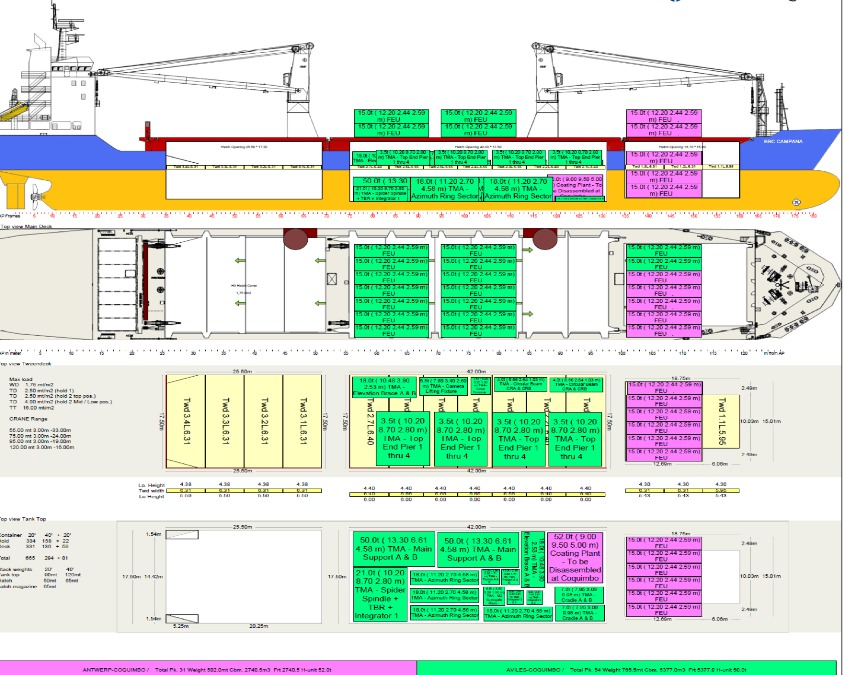

#images 

images for inclusion in latex documents (or anyplace else). The idea is there is one master copy of any image/org chart etc .. which is used in all docs rather than copies ending up in many different repos .. well we can try right ?. 

You should have this in the root of dm-docs - other docs will sym link to it as images.

<embed>
<table>
<tr><th>Image <th>File name<th>Description
<tr><td>  <td> 2kDesign.jpg<td> Year 2000 optical design diagram 
<tr> <td><td>AnnualReprocessingDataFlow.pdf <td>
<tr><td> <td>AstronomerCartoon.png <td> Cartoon about astronomers not using telescopes (Zeljko)
<tr><td> <td>BarringerCrater.png  <td> Picture of Barringer crater used in meteor slides .. it shows to scale Statue of Liberty and LSST in the crater (Zeljko)
<tr><td> <td>Blast_20-full.jpg<td> Photo showing blast on top  Cerro Pachon during the leveling of the peak
<tr><td> <td>CMB.png<td> Lambda CDM graphic showing the big bang through to WMAP
<tr><td> <td>DAQbb.jpg<td> Data Acquisition System Back Board at NCSA (2017)
<tr><td> <td>DAQfb.jpg<td> Data Acquisition System Front  Board at NCSA (2017)
<tr><td> <td>DMMasterSchedule.png<td> PNG of DM Master schedule for slides
<tr><td> <td>DMSCommonServices.pdf<td>   DM Common services from Architecture (LDM-148)
<tr><td> <td>DMSDeployment.pdf<td> DN Deployment from Arch (LDM-148)
<tr><td> <td>DMS_Architecture.png<td> High level view of DM architecture from LDM-148
<tr><td> <td>DM_Application_Software_Arch.png<td> DM software stack on diagram (KT)
<tr><td> <td>DarkMatterPie.png<td>  Pie Chart of Dark Matter and Physical Matter - What do we know ?
<tr><td> <td>DataBackbone.pdf<td> Components of Data BackBone from LDM-148
<tr><td> <td>DmMap.png<td> Geographical map showing DM team locations
<tr><td> <td>DmOrg.pdf<td> DM Org chart from LDM-294
<tr><td> <td>DocTree.pdf<td>DM Doc Tree  from LDM-294
<tr><td> <td>EndUserDocs.pdf<td>DM End users Doc Tree  from LDM-294
<tr><td> <td>GaiaLSSTaccuracy.png<td> Plot showing Gaia accuracies for brighter objects and overlapping with LSST for fainter objects
<tr><td> <td>Gaia_Sticker_Fairing_wo_frame_2k_small.jpg<td> The nice fairing logo from the Gaia Soyuz
<tr><td> <td>Gaia_liftoff_9_625.jpg<td> Gaia Launch Photo
<tr><td> <td>HSC.png<td> HSC processing status early 2017 (RHL)
<tr><td> <td>HSCcosmos.png<td>Part of the Hyper Suprime Cam image from the GOODs field, the equivalent image from SDSS is also in the list. 
<tr><td> <td>HSTpubs.jpg<td> Plot from STScI showing number of publications from archive and original observations.
<tr><td> <td>IIPDiagram.png<td> Diagram showing Full data flow for Alerts from DAQ to NCSA (Jim Parsons?)
<tr><td> <td>ImSim-2011-half.jpg<td> Simulated image from one LSST CCD
<tr><td> <td>LSSTSciOpsOrg.png<td> Organisation of Science Operations Department in LSST Ops.
<tr><td> <td>LSSTconstStart.jpg<td> LSST construction start logo/sticker 2014
<tr><td> <td>LSSTopsCom.jpg<td> Communications flows in LSST operations
<tr><td> <td>LSSTopsHighLevelOrg.png<td>  High level org chart for LSST operations
<tr><td> <td>M1M3surCell.jpg<td> M1M3 Surrogate Mirror on the M1M3 Cell at CAID.
<tr><td> <td>MiddlewareInfrastructure.pdf<td> How middleware fits in the DM architecture from LDM-148
<tr><td> <td>NearRealTimeDataFlow.pdf<td> Data Flow for Prompt processing from LDM-148
<tr><td> <td>Org_Chart_LSST.png<td> LSST construction high level org chart
<tr><td> <td>PDACsky.png<td> Screen grab of Firefly showing sky image in PDAC
<tr><td> <td>PDACtable.png<td> Screen grab of table display in notebook in PDAC
<tr><td> <td>Raft_of_the_Medusa_-_Theodore_Gericault.jpg<td>Raft of the Medusa - Theodore Gericault (used in some slides) 
<tr><td> <td>SDSScosmos.png<td> SDSS image from part of the COSMOS sky - the same patch is in the list for HSC.
<tr><td> <td>SciencePlatform.pdf<td>  Science Platform components from LDM-148
<tr><td> <td>Ship.jpg<td> Theoretical ship showing containers which could carry LSST components in 2018 to Chile
<tr><td> <td>ShippingList.jpg<td> The $98 shipping list for 2018 (would all go on the Ship mentioned above)
<tr><td> <td>SitesDataflow.jpg<td> Emily's new Data flow diagram showing sites and the networks fro ops.
<tr><td> <td>SizingModel.pdf<td> Older but valid document tree showing flow of requirements LSE-81  and others to LDM-144 (Sizing model)
<tr><td> <td>asteroidImpacts.png<td> Single image of Shoemaker-Levy and Tunguska showing potential and actual impacts
<tr><td> <td>bepiclogo.png<td> Logo for BepiColombo
<tr><td> <td>camera.pdf<td> LSST  camera cut away showing parts  with outline of a person to show scale.
<tr><td> <td>casjobs.png<td> Screen shot of CasJobs for submitting queries to SDSS.
<tr><td> <td>catopt1.pdf<td> Option one for catalogs - full DB access to source and object
<tr><td> <td>catopt2.pdf<td> Option 2 (or a potential alternative) - DB access for object but Spark Access at source level
<tr><td> <td>cerro.png<td> Cerro Pachon
<tr><td> <td>cerroAug2017.jpg<td>Cerro Pachon August 2017
<tr><td> <td>cerroDec2017.jpg<td>Cerro Pachon Dec 2017
<tr><td> <td>cerroMay2017.jpg<td>Cerro Pachon May 2017
<tr><td> <td>cerroRender.jpg<td>Cerro Pachon Rendered Drawing
<tr><td> <td>coatingPlant.jpg<td> Mirror Coating Plant 2017 Germany
<tr><td> <td>combCE.png<td>
<tr><td> <td>comsched.png<td>
<tr><td> <td>coverage.jpg<td>
<tr><td> <td>dataMining.png<td>
<tr><td> <td>datasched.png<td>
<tr><td> <td>euclid.png<td>
<tr><td> <td>exm.png<td>
<tr><td> <td>fdphase.png<td>
<tr><td> <td>fig-lsst-science-platform-extended.pdf<td>
<tr><td> <td>fops.png<td>
<tr><td> <td>fov.png<td>
<tr><td> <td>gaiaCE.png<td>
<tr><td> <td>gaiamap.png<td>
<tr><td> <td>grid.png<td>
<tr><td> <td>hipjt.png<td>
<tr><td> <td>hstCE.png<td>
<tr><td> <td>juice.png<td>
<tr><td> <td>jupyterLab.png<td>
<tr><td> <td>jwst.png<td>
<tr><td> <td>l2Optic.png<td>
<tr><td> <td>lsstplan.jpg<td>
<tr><td> <td>mp_starmap.pdf<td>
<tr><td> <td>newHorizons.jpg<td>
<tr><td> <td>ngc1232.jpg<td>
<tr><td> <td>olddmorg.png<td>
<tr><td> <td>opsStaffProfile.jpg<td>
<tr><td> <td>pdac.jpg<td>
<tr><td> <td>pdphase.png<td>
<tr><td> <td>planckhistory.jpg<td>
<tr><td> <td>precon.png<td>
<tr><td> <td>probman.png<td>
<tr><td> <td>raftCCD.png<td>
<tr><td> <td>raftSensor.png<td>
<tr><td> <td>raftSensorAssembly.png<td>
<tr><td> <td>raftTower.png<td>
<tr><td> <td>scibookcover.pdf<td>
<tr><td> <td>servdocs.png<td>
<tr><td> <td>showsky.png<td>
<tr><td> <td>skyserverdr3.png<td>
<tr><td> <td>solo.png<td>
<tr><td> <td>sshtm.jpg<td>
<tr><td> <td>summit24hrs.jpg<td>
<tr><td> <td>tinto.pdf/jpg<td>  Tintoretto painting "Origin of the Milky Way" 1575 National Gallery London 
<\table>
<\embed>
